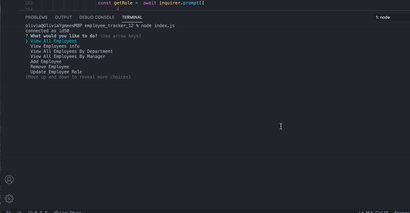

# [employee_tracker_12]

  # Table of Contents 

 - [Description](#description)
 - [Installation](#installation)
 - [User Stroy](#userstory)
  - [Business Context](#businesscontext)
 - [Contributing](#contributing)
 - [Credits](#credits)
 - [Questions](#questions)

##  Description:

  

Create an application to architect and build a solution for managing a company's employees using node, inquirer, and MySQL.
that can be used to read , add, update and delete employee tracker.

## Installation:

`npm install mysql`

`npm i inquirer`

## User Story

As a business owner
I want to be able to view and manage the departments, roles, and employees in my company
So that I can organize and plan my business

## Contributing:

Triology and North Western Bootcamp provide the front end material (db.json, index.js, styles.css, index.html, notes.html )

 ## Credits:

 This is my work besides the front-end material and ASK BCS Learning assistant advice especially for async function part.

 ## Questions:

 For questions about the Generator you can go to my GitHub Page at the following Link:

 - [GitHub Profile](https://github.com/Oliviapark113)

 - [View Code](https://github.com/Oliviapark113/employee_tracker_12)

   For additional questions please reach out to my email at: oliviaypark113@gmail.com

  ## Demo Project.

  

